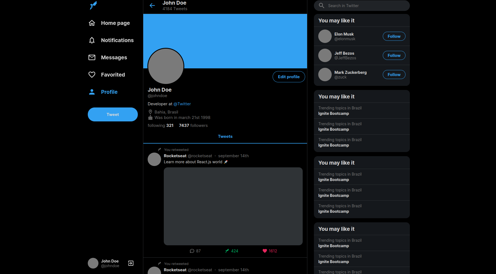

<p align="center">
  
</p>

<p align="center">
  <a href="#-technologies">Technologies</a> •
  <a href="#-getting-started">Getting started</a> •
  <a href="#-license">License</a>
</p>

<p align="center">
  
</p>

## 🚀 Technologies

- [ReactJS](https://reactjs.org/)
- [TypeScript](https://www.typescriptlang.org/)
- [React-Sticky-Box](https://react-sticky-box.codecks.io/)
- [Styled-Components](https://styled-components.com/)
- [Styled-Icons](https://styled-icons.dev/)

## 💻 Getting started

### Requirements

- [Node.js](https://nodejs.org/en/)
- [Yarn](https://classic.yarnpkg.com/) or [npm](https://www.npmjs.com/package/npm)

**Clone the project and access the folder**

```bash
git clone https://github.com/filipebteixeira98/twitter-ui-clone.git && cd twitter-ui-clone
```

**Follow the steps below**

```bash
# Install the dependencies
$ yarn

# Start the application
$ yarn start
```

## 📝 License

This project is licensed under the MIT License - see the [LICENSE](LICENSE) file for details.

---

<p align="center">
  Made with 💜 by <a href="https://www.linkedin.com/in/filipebteixeira98/">Filipe Teixeira</a>
</p>
